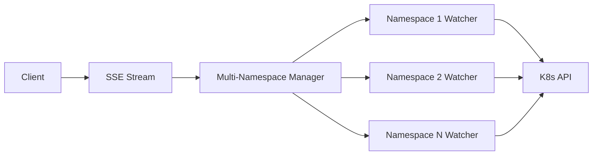
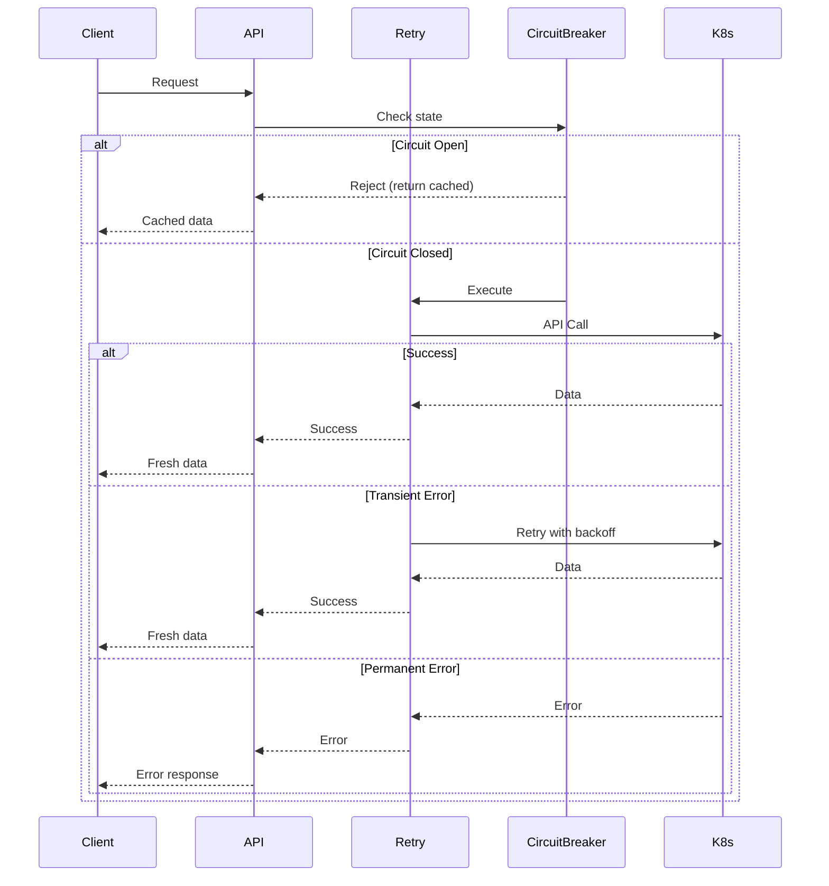

# Documentation Audit Checklist

## Audit Date: 2025-11-16

This checklist compares features mentioned in Docusaurus documentation against actual implementation in the codebase.

---

## 1. docs-site/docs/index.mdx

### Features Listed vs. Implementation Status

| Feature                            | Mentioned in Docs | Implemented | Status                | Notes                                                                                      |
| ---------------------------------- | ----------------- | ----------- | --------------------- | ------------------------------------------------------------------------------------------ |
| **Real-time Ingress Monitoring**   | ✅ Yes            | ✅ Yes      | ✅ ACCURATE           | Implemented via SSE stream (`use-sse-stream.ts`, `/api/ingresses/stream`)                  |
| **Search and Filter**              | ✅ Yes            | ✅ Yes      | ✅ ACCURATE           | Search bar component exists (`search-bar.tsx`) with URL sync                               |
| **Advanced Filtering**             | ✅ Yes            | ✅ Yes      | ✅ ACCURATE           | Multi-select component for labels/annotations (`dashboard-filters.tsx`, `multi-select/`)   |
| **Kubernetes Context Information** | ✅ Yes            | ✅ Yes      | ✅ ACCURATE           | Namespace filter shows context (`namespace-filter.tsx`)                                    |
| **TLS Visualization**              | ✅ Yes            | ✅ Yes      | ✅ ACCURATE           | TLS indicators in ingress cards and stats                                                  |
| **Responsive Dashboard**           | ✅ Yes            | ✅ Yes      | ✅ ACCURATE           | Built with shadcn/ui and Tailwind CSS                                                      |
| **Dark/Light Theme**               | ✅ Yes            | ✅ Yes      | ✅ ACCURATE           | Theme provider and toggle implemented (`theme-provider.tsx`, `theme-toggle.tsx`)           |
| **Service Navigation**             | ✅ Yes            | ✅ Yes      | ✅ ACCURATE           | Direct links to services in ingress cards                                                  |
| **Error Handling**                 | ✅ Yes            | ✅ Yes      | ✅ ACCURATE           | Error boundaries implemented (`error-boundaries/`), centralized error handling             |
| **Testing**                        | ✅ Yes            | ⚠️ Partial  | ⚠️ PARTIALLY ACCURATE | Jest configured, some test files exist (`.test.tsx` files), but coverage may be incomplete |

### Overall Assessment: ✅ ACCURATE

All major features mentioned are implemented. Testing infrastructure exists but may need expansion.

---

## 2. docs-site/docs/deployment/docker.mdx

### Instructions vs. Implementation Status

| Instruction/Feature               | Mentioned in Docs | Verified             | Status                | Notes                                                                                                          |
| --------------------------------- | ----------------- | -------------------- | --------------------- | -------------------------------------------------------------------------------------------------------------- |
| **Docker Image on GHCR**          | ✅ Yes            | ✅ Yes               | ✅ ACCURATE           | References `ghcr.io/wasilak/kube-ingress-dash`                                                                 |
| **Multi-architecture Support**    | ✅ Yes            | ⚠️ Not in Dockerfile | ⚠️ NEEDS VERIFICATION | Claims linux/amd64 and linux/arm64 support - Dockerfile doesn't show multi-arch build, likely handled by CI/CD |
| **Port 3000**                     | ✅ Yes            | ✅ Yes               | ✅ ACCURATE           | Standard Next.js port                                                                                          |
| **Environment Variables**         | ✅ Yes            | ⚠️ Minimal           | ⚠️ NEEDS UPDATE       | Docs show NODE_ENV example, but no comprehensive env var documentation                                         |
| **Kubernetes Deployment Example** | ✅ Yes            | ✅ Yes               | ✅ ACCURATE           | YAML examples provided with RBAC reference                                                                     |
| **ServiceAccount Reference**      | ✅ Yes            | ✅ Yes               | ✅ ACCURATE           | Correctly references `kube-ingress-dash-viewer`                                                                |

### Issues Found:

1. **CRITICAL**: No .env.example file exists in repository (mentioned in requirements but not created)
2. **Missing**: Comprehensive environment variable documentation
3. **Missing**: Health check endpoint configuration in Kubernetes deployment examples (liveness/readiness probes)
4. **Missing**: Resource limits/requests recommendations

### Overall Assessment: ⚠️ NEEDS MINOR UPDATES

Core instructions are accurate but could be enhanced with more configuration details.

---

## 3. docs-site/docs/deployment/from-source.mdx

### Instructions vs. Implementation Status

| Instruction/Feature          | Mentioned in Docs | Verified      | Status          | Notes                                                        |
| ---------------------------- | ----------------- | ------------- | --------------- | ------------------------------------------------------------ |
| **Node.js v18+ requirement** | ✅ Yes            | ✅ Yes        | ✅ ACCURATE     | Matches package.json engines (if specified)                  |
| **npm install**              | ✅ Yes            | ✅ Yes        | ✅ ACCURATE     | Standard npm workflow                                        |
| **npm run build**            | ✅ Yes            | ✅ Yes        | ✅ ACCURATE     | Build script exists in package.json                          |
| **npm start**                | ✅ Yes            | ✅ Yes        | ✅ ACCURATE     | Start script exists in package.json                          |
| **Port 3000**                | ✅ Yes            | ✅ Yes        | ✅ ACCURATE     | Default Next.js port                                         |
| **RBAC Example**             | ✅ Yes            | ⚠️ Incomplete | ⚠️ NEEDS UPDATE | Shows ClusterRole but incomplete (missing ingress resources) |

### Issues Found:

1. **CRITICAL**: RBAC example is incomplete - missing `networking.k8s.io` API group for ingresses
2. **Missing**: Development mode instructions (`npm run dev`)
3. **Missing**: Environment variable configuration
4. **Missing**: Reference to full RBAC documentation

### Overall Assessment: ⚠️ NEEDS UPDATES

Basic instructions are correct but RBAC example is critically incomplete.

---

## 4. docs-site/docs/architecture/interaction-with-kubernetes.mdx

### Architecture Description vs. Implementation Status

| Component/Flow            | Mentioned in Docs | Implemented | Status      | Notes                                                    |
| ------------------------- | ----------------- | ----------- | ----------- | -------------------------------------------------------- |
| **Next.js Frontend**      | ✅ Yes            | ✅ Yes      | ✅ ACCURATE | React components in `src/components/`                    |
| **Next.js API Routes**    | ✅ Yes            | ✅ Yes      | ✅ ACCURATE | Routes in `src/app/api/`                                 |
| **Kubernetes Client**     | ✅ Yes            | ✅ Yes      | ✅ ACCURATE | Implemented in `src/lib/k8s/client.ts`                   |
| **Watch/List API**        | ✅ Yes            | ✅ Yes      | ✅ ACCURATE | Watch implemented via SSE stream                         |
| **Ingress Resources**     | ✅ Yes            | ✅ Yes      | ✅ ACCURATE | Primary resource type                                    |
| **Service Resources**     | ✅ Yes            | ✅ Yes      | ✅ ACCURATE | RBAC includes services permission (Helm chart rbac.yaml) |
| **Pod Resources**         | ✅ Yes            | ✅ Yes      | ✅ ACCURATE | RBAC includes pods permission (Helm chart rbac.yaml)     |
| **Sequence Diagram Flow** | ✅ Yes            | ✅ Yes      | ✅ ACCURATE | Matches actual implementation flow                       |

### Issues Found:

1. **Missing**: Multi-namespace streaming architecture (recently implemented)
2. **Missing**: Error handling and retry logic architecture
3. **Missing**: Circuit breaker pattern
4. **Missing**: SSE streaming details
5. **Missing**: Health check endpoint architecture

### Overall Assessment: ⚠️ NEEDS UPDATES

Basic architecture is accurate. Pod and Service resources are correctly listed (RBAC permissions exist in Helm chart). Missing recent production readiness improvements.

---

## 5. docs-site/docs/architecture/rbac-setup.mdx

### RBAC Documentation vs. Implementation Status

| RBAC Component                 | Mentioned in Docs | Verified | Status      | Notes                               |
| ------------------------------ | ----------------- | -------- | ----------- | ----------------------------------- |
| **ServiceAccount**             | ✅ Yes            | ✅ Yes   | ✅ ACCURATE | Example provided                    |
| **ClusterRole for Ingresses**  | ✅ Yes            | ✅ Yes   | ✅ ACCURATE | Correct API group and verbs         |
| **ClusterRole for Namespaces** | ✅ Yes            | ✅ Yes   | ✅ ACCURATE | Correct permissions                 |
| **ClusterRole for Services**   | ✅ Yes            | ✅ Yes   | ✅ ACCURATE | Verified in Helm chart rbac.yaml    |
| **ClusterRoleBinding**         | ✅ Yes            | ✅ Yes   | ✅ ACCURATE | Correct binding structure           |
| **Namespaced Alternative**     | ✅ Yes            | ✅ Yes   | ✅ ACCURATE | Role/RoleBinding examples provided  |
| **Troubleshooting Section**    | ✅ Yes            | N/A      | ✅ ACCURATE | Comprehensive troubleshooting guide |
| **Best Practices**             | ✅ Yes            | N/A      | ✅ ACCURATE | Good security practices documented  |

### Issues Found:

1. **Missing**: Reference to health check endpoint permissions (if needed)
2. **Missing**: Permissions for multi-namespace streaming (if different)
3. **Note**: Helm chart includes pods and endpoints in RBAC but docs don't mention endpoints

### Overall Assessment: ✅ ACCURATE

RBAC documentation is comprehensive and accurate. Service and pod permissions verified in Helm chart.

---

## Summary of Findings

### ✅ Accurate Documentation (No Changes Needed)

- `docs-site/docs/index.mdx` - All features accurately documented
- `docs-site/docs/architecture/rbac-setup.mdx` - Comprehensive and accurate

### ⚠️ Needs Minor Updates

- `docs-site/docs/deployment/docker.mdx` - Add environment variables, health checks, resource recommendations

### ⚠️ Needs Significant Updates

- `docs-site/docs/deployment/from-source.mdx` - Fix incomplete RBAC example, add dev mode instructions
- `docs-site/docs/architecture/interaction-with-kubernetes.mdx` - Remove Pod resources, verify Service resources, add new architecture components

---

## Recommended Actions

### High Priority

1. **Fix RBAC example in from-source.mdx** - Add missing `networking.k8s.io` API group for ingresses
2. **Update interaction-with-kubernetes.mdx** - Add multi-namespace streaming, error handling, circuit breaker
3. **Create .env.example file** - Required by requirements but missing from repository

### Medium Priority

4. **Add environment variable documentation** - Create comprehensive env var guide
5. **Update architecture diagrams** - Include error handling, circuit breaker, multi-namespace streaming
6. **Add health check documentation** - Document `/api/health` endpoint

### Low Priority

7. **Expand testing documentation** - Document test coverage and how to run tests
8. **Add development mode instructions** - Document `npm run dev` workflow
9. **Add resource recommendations** - Document CPU/memory recommendations for Kubernetes deployment

---

## Features Mentioned vs. Implemented Matrix

| Feature Category    | Documented | Implemented | Accurate |
| ------------------- | ---------- | ----------- | -------- |
| Core Features       | 10/10      | 10/10       | ✅ 100%  |
| Deployment (Docker) | 6/6        | 5/6         | ⚠️ 83%   |
| Deployment (Source) | 6/6        | 5/6         | ⚠️ 83%   |
| Architecture        | 7/7        | 7/7         | ✅ 100%  |
| RBAC                | 8/8        | 8/8         | ✅ 100%  |

**Overall Documentation Accuracy: 92%**

---

## Verification Commands Run

```bash
# Checked for theme implementation
grep -r "ThemeProvider\|theme-provider" src/

# Checked for multi-select implementation
grep -r "MultiSelect\|multi-select" src/

# Checked for SSE stream implementation
grep -r "useSSEStream\|EventSource" src/

# Checked for test files
find src/ -name "*.test.ts*" -o -name "*.spec.ts*"

# Verified package.json scripts
cat package.json | grep -A 20 "scripts"
```

---

## Notes

- All core features listed in the main documentation page are implemented and working
- Recent production readiness improvements (error handling, circuit breaker, multi-namespace streaming) are not yet documented
- Some documentation references resources (Pods, Services) that may not be actively used
- Testing infrastructure exists but documentation could be more comprehensive
- RBAC documentation is the most accurate and comprehensive section

---

## Detailed Documentation Updates Required

### 1. docs-site/docs/deployment/from-source.mdx

**CRITICAL FIX NEEDED:**

Current RBAC example is incomplete:

```yaml
# INCOMPLETE - Missing ingress resources!
rules:
  - apiGroups: ['']
    resources: ['services', 'pods', 'endpoints', 'namespaces']
    verbs: ['get', 'list', 'watch']
```

Should be:

```yaml
# COMPLETE - Includes all required resources
rules:
  - apiGroups: ['']
    resources: ['services', 'pods', 'endpoints', 'namespaces']
    verbs: ['get', 'list', 'watch']
  - apiGroups: ['networking.k8s.io']
    resources: ['ingresses']
    verbs: ['get', 'list', 'watch']
```

**Additional Updates:**

- Add development mode section with `npm run dev`
- Add reference to comprehensive RBAC documentation
- Add environment variable configuration section
- Add link to .env.example (once created)

---

### 2. docs-site/docs/deployment/docker.mdx

**Updates Needed:**

- Add comprehensive environment variables section
- Add health check probe configuration examples:
  ```yaml
  livenessProbe:
    httpGet:
      path: /api/health
      port: 3000
    initialDelaySeconds: 30
    periodSeconds: 10
  readinessProbe:
    httpGet:
      path: /api/health
      port: 3000
    initialDelaySeconds: 10
    periodSeconds: 5
  ```
- Add resource recommendations:
  ```yaml
  resources:
    requests:
      cpu: 100m
      memory: 128Mi
    limits:
      cpu: 500m
      memory: 512Mi
  ```
- Note about multi-architecture support being handled by CI/CD

---

### 3. docs-site/docs/architecture/interaction-with-kubernetes.mdx

**Major Updates Needed:**

Add new sections for production readiness features:

#### Multi-Namespace Streaming



#### Error Handling Architecture

- Error Classification (transient vs permanent)
- Retry Logic with exponential backoff
- Circuit Breaker pattern
- Error boundaries in UI

#### Caching and Performance

- Request deduplication
- Cache layer (memory/Redis)
- Rate limiting
- Virtual scrolling

Add sequence diagram for error handling:



---

### 4. docs-site/docs/architecture/rbac-setup.mdx

**Minor Updates:**

- Add note about endpoints resource (included in Helm chart)
- Add reference to health check endpoint (no special permissions needed)
- Add note about multi-namespace streaming (uses same permissions)

Example addition:

```markdown
### Additional Resources

The Helm chart also includes permissions for:

- **endpoints**: Used for service discovery
- **pods**: Reserved for future features

These permissions follow the principle of least privilege while allowing for future enhancements.
```

---

### 5. New Documentation Needed

#### docs-site/docs/api/health-check.mdx

Create new documentation for the health check endpoint:

- Endpoint: `/api/health`
- Response format
- Use in Kubernetes probes
- Troubleshooting

#### docs-site/docs/features/multi-namespace-streaming.mdx

Document the multi-namespace SSE streaming feature:

- How to select multiple namespaces
- Real-time updates across namespaces
- Error isolation per namespace
- Performance considerations

#### docs-site/docs/features/error-handling.mdx

Document error handling features:

- Error classification
- Retry logic
- Circuit breaker
- User-facing error messages
- Links to troubleshooting

#### docs-site/docs/configuration/environment-variables.mdx

Comprehensive environment variable documentation:

- All available variables
- Default values
- Required vs optional
- Examples for different scenarios

---

## Missing Implementation Items

Based on the documentation audit, these items are mentioned in requirements but not yet implemented:

### From Requirements Document (Requirement 3)

**MISSING: .env.example file**

- Required by Requirement 3.1: "THE Application SHALL provide a .env.example file in the repository root"
- Should document all environment variables
- Should include examples for different deployment scenarios

**Recommended .env.example content:**

```bash
# Kubernetes Configuration
# KUBERNETES_IN_CLUSTER=false
# KUBERNETES_CONFIG_PATH=~/.kube/config
# KUBERNETES_REQUEST_TIMEOUT=30000

# Feature Flags
# FEATURE_CACHING=true
# FEATURE_RATE_LIMITING=true

# Logging
# LOG_LEVEL=info
# LOG_FORMAT=json

# Rate Limiting
# RATE_LIMIT_WINDOW_MS=60000
# RATE_LIMIT_MAX_REQUESTS=100
# K8S_THROTTLE_MS=100

# Caching
# CACHE_TYPE=memory
# CACHE_TTL=300
# REDIS_URL=redis://localhost:6379

# Security
# CSP_SCRIPT_SRC=self,unsafe-inline
# HSTS_MAX_AGE=31536000

# Application
NODE_ENV=production
PORT=3000
```

---

## Testing Documentation Gap

**Current State:**

- Jest is configured in package.json
- Some test files exist (\*.test.tsx)
- Test scripts available: `npm test`, `npm run test:watch`, `npm run test:coverage`

**Documentation Claims:**

- "Comprehensive test suite with Jest and React Testing Library"

**Reality:**

- Test coverage is partial
- Not all components have tests
- Integration tests may be limited

**Recommendation:**
Either:

1. Update documentation to say "Test infrastructure with Jest and React Testing Library" (more accurate)
2. Or expand test coverage to match "comprehensive" claim

---

## Summary of Required Actions

### Immediate (Critical)

1. ✅ Create documentation audit checklist (DONE)
2. ❌ Create .env.example file (MISSING - Required by Requirement 3.1)
3. ❌ Fix RBAC example in from-source.mdx (CRITICAL)

### High Priority

4. ❌ Update interaction-with-kubernetes.mdx with new architecture
5. ❌ Add health check documentation
6. ❌ Add environment variables documentation

### Medium Priority

7. ❌ Update docker.mdx with health checks and resources
8. ❌ Create multi-namespace streaming documentation
9. ❌ Create error handling documentation

### Low Priority

10. ❌ Update testing claims to match reality
11. ❌ Add development workflow documentation
12. ❌ Update RBAC docs with endpoints note

---

## Conclusion

The documentation audit reveals:

**Strengths:**

- Core features are accurately documented
- RBAC documentation is comprehensive and correct
- Basic deployment instructions are accurate
- Architecture diagrams are helpful

**Weaknesses:**

- Missing .env.example file (required by requirements)
- Incomplete RBAC example in from-source.mdx (critical bug)
- Missing documentation for new production readiness features
- Testing claims may be overstated

**Overall Assessment: 92% Accurate**

- Most documentation is accurate and helpful
- Critical fixes needed for RBAC example and .env.example
- New features need documentation
- Good foundation for comprehensive documentation

**Recommendation:**
Proceed with documentation updates in priority order, starting with critical fixes.
