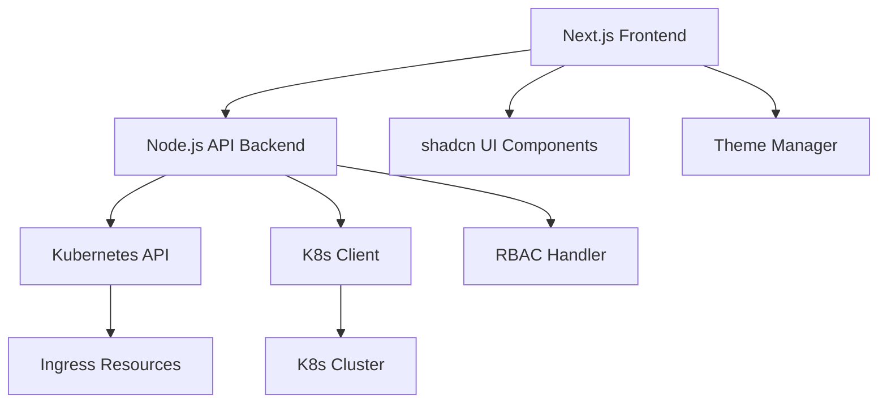

# Design Document: Kubernetes Ingress Dashboard

## Overview

The Kubernetes Ingress Dashboard is a real-time monitoring and navigation tool built with Next.js (React) and Node.js backend. It connects to the Kubernetes API to stream ingress changes, presenting them in an attractive, searchable interface with light/dark/system theme support. The application will be containerized with Docker and deployable via a Helm chart with proper RBAC configuration.

## Steering Document Alignment

### Technical Standards (tech.md)
[No tech.md exists yet - this design will establish initial technical standards]

### Project Structure (structure.md)
[No structure.md exists yet - this design will establish initial structural conventions]

## Code Reuse Analysis

### Existing Components to Leverage
- **[None initially]**: This is a new application with no existing codebase to leverage initially
- **Kubernetes Client Libraries**: Will leverage official Kubernetes JavaScript client libraries
- **shadcn/ui Components**: Will use the shadcn React component library for UI elements

### Integration Points
- **Kubernetes API**: Application will connect via official Kubernetes client to stream ingress resources
- **Environment Configuration**: Will read standard Kubernetes environment variables and config files

## Architecture

The application follows a microservice architecture pattern with a Next.js frontend and Node.js backend. The backend handles all Kubernetes API interactions, while the frontend focuses on UI rendering and user interactions.

### Modular Design Principles
- **Single File Responsibility**: Each file should handle one specific concern or domain
- **Component Isolation**: Create small, focused components rather than large monolithic files
- **Service Layer Separation**: Separate data access (Kubernetes API), business logic, and presentation layers
- **Utility Modularity**: Break utilities into focused, single-purpose modules



## Components and Interfaces

### Kubernetes Service (Backend)
- **Purpose:** Handles all communication with the Kubernetes API, including streaming ingress changes
- **Interfaces:** 
  - getIngresses(): Promise<IngressData[]>
  - watchIngressEvents(): EventEmitter
- **Dependencies:** Official Kubernetes JavaScript client library
- **Reuses:** Standard Kubernetes authentication patterns

### Ingress Data Model (Backend/Frontend)
- **Purpose:** Represents ingress resources in a simplified format for the UI
- **Interfaces:** 
  - id: string
  - name: string
  - namespace: string
  - hosts: string[]
  - paths: string[]
  - urls: string[]
  - annotations: Object
  - creationTimestamp: string
- **Dependencies:** None
- **Reuses:** Standard data transformation patterns

### Dashboard UI Component (Frontend)
- **Purpose:** Main dashboard view that displays ingresses as blocks with links
- **Interfaces:** React component accepting ingress data as props
- **Dependencies:** shadcn UI components, React
- **Reuses:** Theme context, search functionality

### Search and Filter Service (Frontend)
- **Purpose:** Handles real-time search and filtering of ingress data
- **Interfaces:**
  - filterIngresses(data: IngressData[], searchTerm: string): IngressData[]
  - updateURL(searchTerm: string): void
  - readURL(): string
- **Dependencies:** React hooks, browser history API
- **Reuses:** URLSearchParams API

### Theme Manager (Frontend)
- **Purpose:** Manages light/dark/system theme preferences
- **Interfaces:**
  - getTheme(): Theme
  - setTheme(theme: Theme): void
  - getSystemTheme(): Theme
- **Dependencies:** React context API, localStorage
- **Reuses:** Standard browser APIs

## Data Models

### IngressData
```
- id: string (unique identifier)
- name: string (name of the ingress resource)
- namespace: string (kubernetes namespace)
- hosts: string[] (hostnames defined in the ingress)
- paths: string[] (path patterns defined in the ingress)
- urls: string[] (computed URLs based on host and path)
- annotations: Object (kubernetes annotations)
- creationTimestamp: string (when the ingress was created)
- tls: boolean (whether TLS is configured)
- status: string (ready, pending, error, etc.)
```

### IngressChangeEvent
```
- type: string (ADDED, MODIFIED, DELETED)
- ingress: IngressData
```

## Error Handling

### Error Scenarios
1. **Kubernetes API Connection Failure:** When the backend cannot connect to the Kubernetes API
   - **Handling:** Display connection error with retry mechanism, provide clear error message in UI
   - **User Impact:** Dashboard shows error state with instructions to check connection settings

2. **RBAC Insufficient Permissions:** When the service account lacks required permissions
   - **Handling:** Log detailed error, provide clear error message with required permissions
   - **User Impact:** Dashboard shows error with specific RBAC requirements for setup

3. **Network Disruption:** When connection to Kubernetes API is temporarily lost
   - **Handling:** Attempt automatic reconnection with exponential backoff
   - **User Impact:** Dashboard shows "Connecting..." indicator and automatically reconnects when possible

4. **Search Query Error:** When search input causes processing errors
   - **Handling:** Catch errors and reset to showing all results
   - **User Impact:** Search continues to work, invalid inputs are ignored gracefully

5. **Theme Loading Error:** When theme preferences cannot be loaded from localStorage
   - **Handling:** Default to system theme and continue normal operation
   - **User Impact:** Default theme is applied without disruption to core functionality

## Testing Strategy

### Unit Testing
- Test Kubernetes service functions for retrieving and transforming ingress data
- Test data transformation utilities to ensure proper ingress data formatting
- Test search and filter functions with various input scenarios
- Use Jest for backend and frontend testing

### Integration Testing
- Test end-to-end flow from Kubernetes API watch events to UI updates
- Test authentication and authorization flows
- Test Docker build and container startup
- Use testing-library for React component testing

### End-to-End Testing
- Test user journey from accessing dashboard to navigating to services via ingress links
- Test theme switching functionality
- Test search and URL parameter integration
- Use Playwright for E2E testing