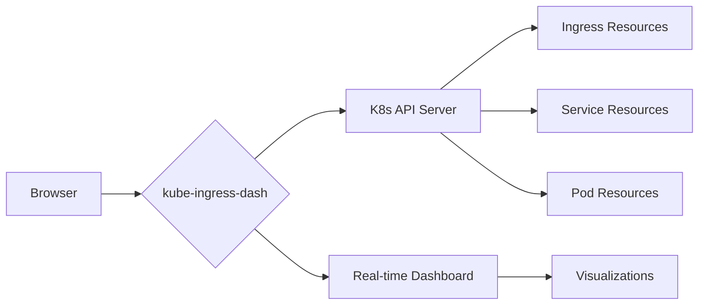

<div align="center">

# kube-ingress-dash 🚀

[](https://github.com/wasilak/kube-ingress-dash/blob/main/LICENSE)
[](https://github.com/wasilak/kube-ingress-dash/releases)
[](https://hub.docker.com/r/kube-ingress-dash/kube-ingress-dash)
[](https://github.com/wasilak/kube-ingress-dash/stargazers)

<p><b>Kubernetes Ingress Dashboard for monitoring and navigating services</b></p>

<p>Real-time visibility into ingress resources, making it easy to discover, access, and monitor services running in your Kubernetes clusters</p>

[**Try Live Demo**](https://example.com) · [**Documentation**](https://wasilak.github.io/kube-ingress-dash) · [**Report Bug**](https://github.com/wasilak/kube-ingress-dash/issues) · [**Request Feature**](https://github.com/wasilak/kube-ingress-dash/issues)

</div>

## 🎯 Why kube-ingress-dash?

Tired of hunting through `kubectl get ingress` outputs? kube-ingress-dash brings your Kubernetes ingress resources to life with beautiful visualizations and intuitive navigation. Built with ❤️ and Next.js, it's the tool that turns complex Kubernetes monitoring into a delightful experience.

## ✨ Features

| Feature | Description | Status |
|--------|-------------|---------|
| 🔄 **Real-time Monitoring** | Watch ingress resources update in real-time | ✅ |
| 🔍 **Smart Search & Filter** | Find ingresses by name, namespace, host, or path | ✅ |
| 🏷️ **Advanced Filtering** | Multi-select for filtering by labels/annotations | ✅ |
| 🌐 **Context Info** | View cluster, namespace, and context details | ✅ |
| 🔒 **TLS Visualization** | Clear indicators for TLS-enabled ingresses | ✅ |
| 🎨 **Responsive UI** | Modern UI with shadcn/ui and Tailwind CSS | ✅ |
| 🌙 **Dark/Light Theme** | Toggle between light, dark, and system themes | ✅ |
| 🧭 **Service Navigation** | Direct links to your services | ✅ |
| 🛡️ **Error Handling** | Comprehensive error boundaries | ✅ |
| 🧪 **Testing** | Jest + React Testing Library | ✅ |

## 🚀 Quick Start

### Deploy with Helm (Recommended)

```bash
# Add the Helm repository
helm repo add kube-ingress-dash https://wasilak.github.io/kube-ingress-dash

# Install the chart
helm install kube-ingress-dash oci://ghcr.io/wasilak/kube-ingress-dash/kube-ingress-dash
```

### Try with Docker

```bash
# Pull and run the latest image
docker run -p 3000:3000 ghcr.io/wasilak/kube-ingress-dash:latest
```

### From Source

```bash
# Clone, build, and run
git clone https://github.com/wasilak/kube-ingress-dash.git
cd kube-ingress-dash
npm install
npm run dev
```

## 🛠️ Prerequisites

- **Kubernetes**: Cluster with appropriate RBAC permissions
- **Node.js**: v18+ (for local development)
- **Docker**: For containerized deployment
- **Helm**: For Kubernetes deployment

## 🏗️ Architecture Overview



## 📋 Kubernetes RBAC Setup

The application requires specific permissions. Set up RBAC with:

```yaml
apiVersion: v1
kind: ServiceAccount
metadata:
  name: kube-ingress-dash-viewer
  namespace: default
---
apiVersion: rbac.authorization.k8s.io/v1
kind: ClusterRole
metadata:
  name: kube-ingress-dash-viewer
rules:
- apiGroups: [""]
  resources: ["services", "pods", "endpoints", "namespaces"]
  verbs: ["get", "list", "watch"]
- apiGroups: ["networking.k8s.io"]
  resources: ["ingresses"]
  verbs: ["get", "list", "watch"]
---
apiVersion: rbac.authorization.k8s.io/v1
kind: ClusterRoleBinding
metadata:
  name: kube-ingress-dash-viewer
roleRef:
  apiGroup: rbac.authorization.k8s.io
  kind: ClusterRole
  name: kube-ingress-dash-viewer
subjects:
- kind: ServiceAccount
  name: kube-ingress-dash-viewer
  namespace: default
```

## 📚 Documentation

For comprehensive documentation and deployment guides, visit our [Documentation Site](https://wasilak.github.io/kube-ingress-dash).

## 🤝 Contributing

We welcome contributions! Here's how you can help:

1. [Fork](https://github.com/wasilak/kube-ingress-dash/fork) the repository
2. Create a feature branch (`git checkout -b feature/amazing-feature`)
3. Commit your changes (`git commit -m 'Add amazing feature'`)
4. Push to the branch (`git push origin feature/amazing-feature`)
5. Open a [Pull Request](https://github.com/wasilak/kube-ingress-dash/compare)

Check out our [Contributing Guide](CONTRIBUTING.md) for more details!

## 📄 License

Distributed under the MIT License. See [LICENSE](LICENSE) for more information.

## 🤖 Support & Community

- 🐛 **Issues**: [GitHub Issues](https://github.com/wasilak/kube-ingress-dash/issues)
- 💬 **Discussions**: [GitHub Discussions](https://github.com/wasilak/kube-ingress-dash/discussions)
- 🐙 **GitHub**: [Follow us](https://github.com/wasilak) for updates

---

<div align="center">

[](https://github.com/wasilak)
[](https://twitter.com/intent/follow?screen_name=kubeingressdash)

**Made with ❤️ for the Kubernetes community**

[⭐ Star this repo if you find it useful!](https://github.com/wasilak/kube-ingress-dash)

</div>