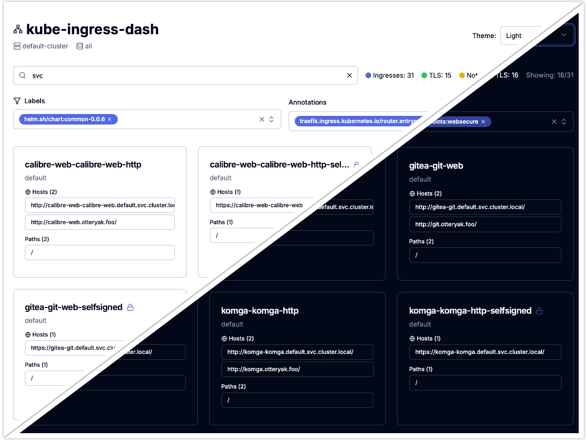

# kube-ingress-dash 🚀

**Kubernetes Ingress Dashboard for monitoring and navigating services**

Real-time visibility into ingress resources, making it easy to discover, access, and monitor services running in your Kubernetes clusters.

[**Documentation**](https://wasilak.github.io/kube-ingress-dash) · [**Report Bug**](https://github.com/wasilak/kube-ingress-dash/issues) · [**Request Feature**](https://github.com/wasilak/kube-ingress-dash/issues)

## 📚 Documentation

For comprehensive documentation and deployment guides, visit our [Documentation Site](https://wasilak.github.io/kube-ingress-dash).

- [Features](https://wasilak.github.io/kube-ingress-dash/docs)
- [Deployment](https://wasilak.github.io/kube-ingress-dash/docs/deployment)
- [Architecture](https://wasilak.github.io/kube-ingress-dash/docs/architecture/interaction-with-kubernetes)
- [RBAC Setup](https://wasilak.github.io/kube-ingress-dash/docs/deployment/helm)

## 🤝 Contributing

We welcome contributions! Here's how you can help:

1. [Fork](https://github.com/wasilak/kube-ingress-dash/fork) the repository
2. Create a feature branch (`git checkout -b feature/amazing-feature`)
3. Commit your changes (`git commit -m 'Add amazing feature'`)
4. Push to the branch (`git push origin feature/amazing-feature`)
5. Open a [Pull Request](https://github.com/wasilak/kube-ingress-dash/compare)

Check out our [Contributing Guide](CONTRIBUTING.md) for more details!

## 📄 License

Distributed under the GNU General Public License v3.0 (GPL-3.0). See [LICENSE](LICENSE) for more information.

## 🤖 Support & Community

- 🐛 **Issues**: [GitHub Issues](https://github.com/wasilak/kube-ingress-dash/issues)
- 💬 **Discussions**: [GitHub Discussions](https://github.com/wasilak/kube-ingress-dash/discussions)
- 🐙 **GitHub**: [Follow us](https://github.com/wasilak) for updates

---

**Made with ❤️ for the Kubernetes community**

[⭐ Star this repo if you find it useful!](https://github.com/wasilak/kube-ingress-dash)
