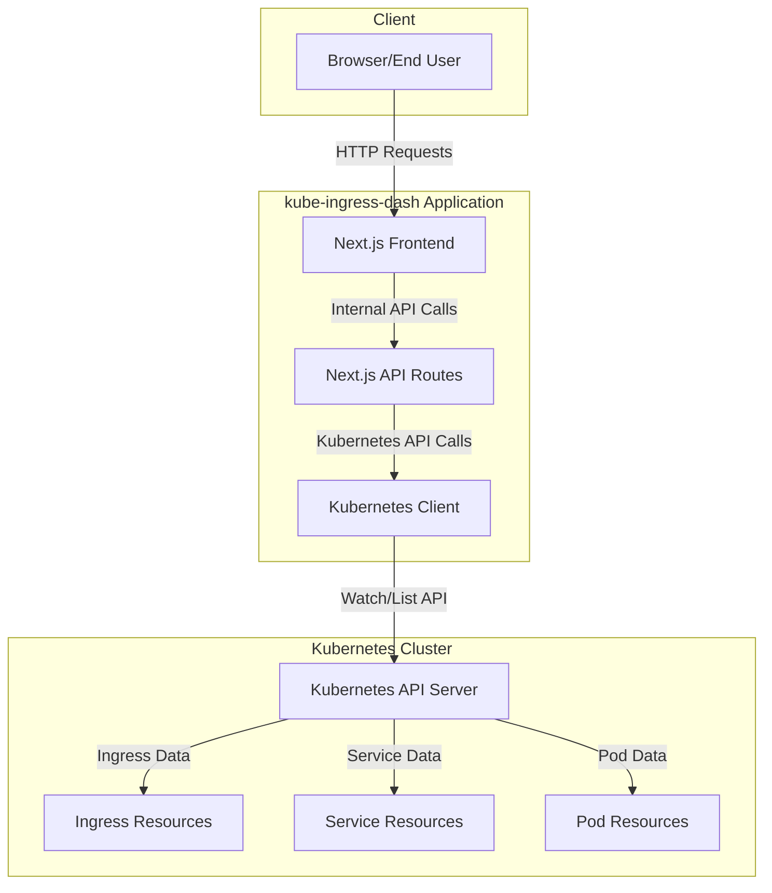
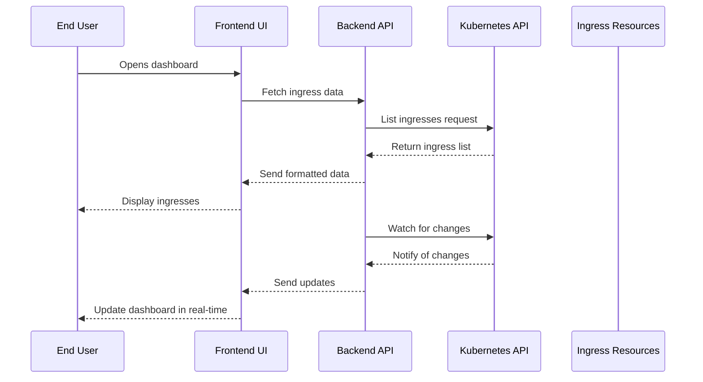
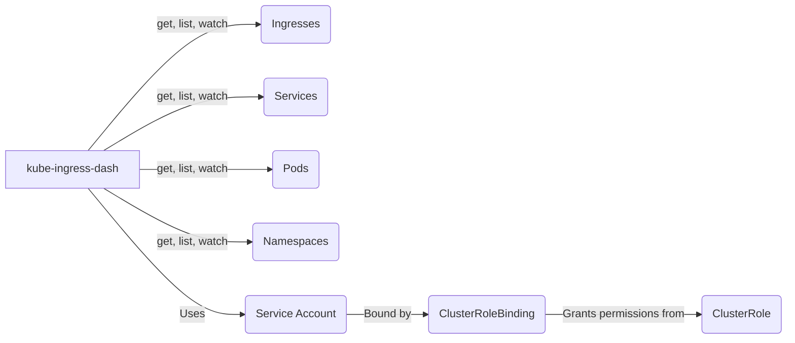
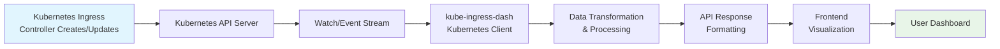

# Architecture: Interaction with Kubernetes

This document describes how kube-ingress-dash interacts with Kubernetes and the overall system architecture.

## System Architecture

The following diagram illustrates the overall architecture of kube-ingress-dash:



## Detailed Interaction Flow

The interaction between kube-ingress-dash and Kubernetes follows this flow:



## Kubernetes Permissions

kube-ingress-dash requires specific RBAC permissions to access Kubernetes resources:



## Data Flow

The data flow within kube-ingress-dash follows this pattern:



## Security Architecture

The security model ensures proper isolation and access control:

```mermaid
graph TB
    subgraph "Security Boundaries"
        A[kube-ingress-dash<br/>Pod Security Context]
        B[Service Account<br/>with Minimal Permissions]
        C[ClusterRole<br/>with Limited RBAC Rules]
        D[Network Policies<br/>(if configured)]
    end
    
    A --> B
    B --> C
    A --> D
```