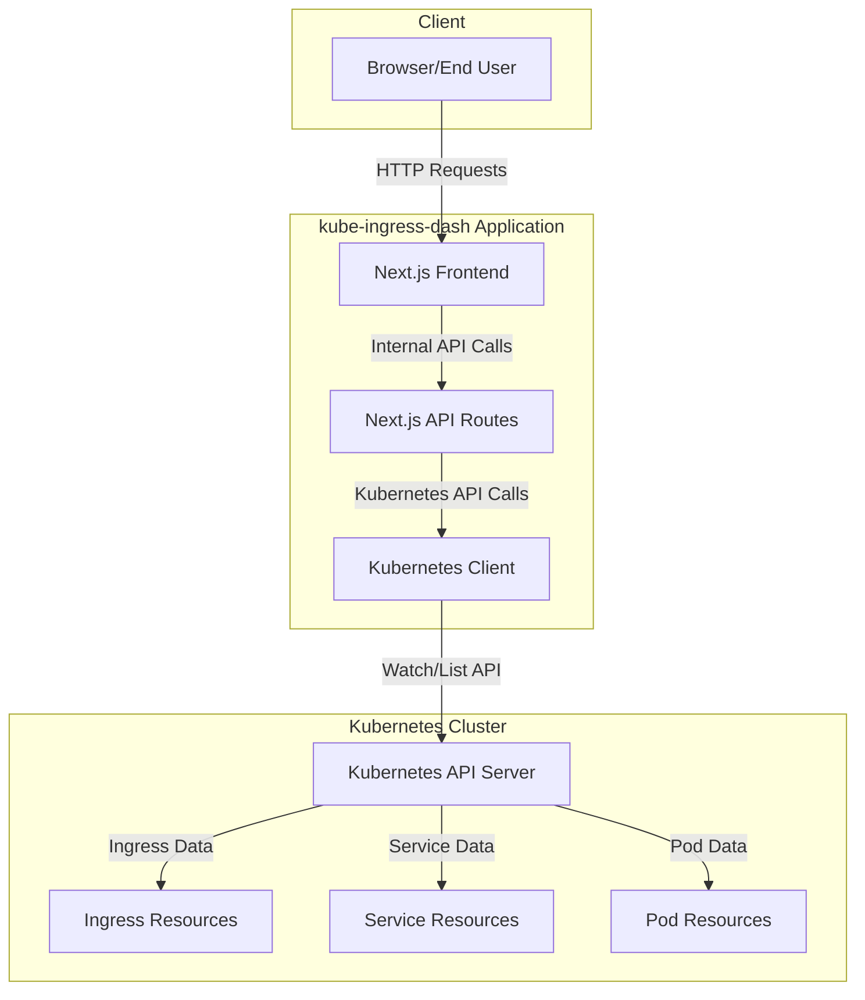
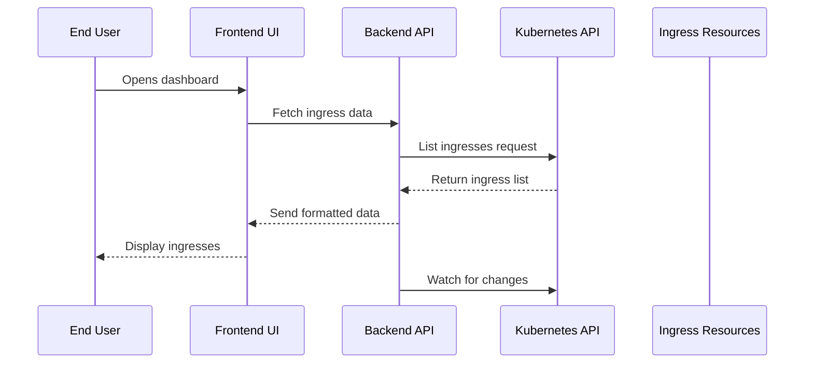
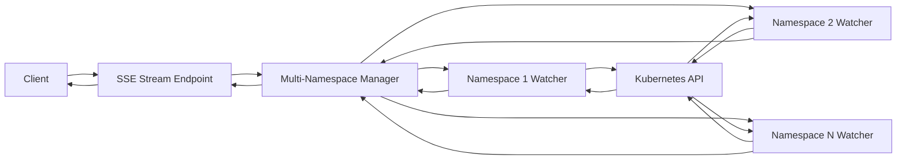
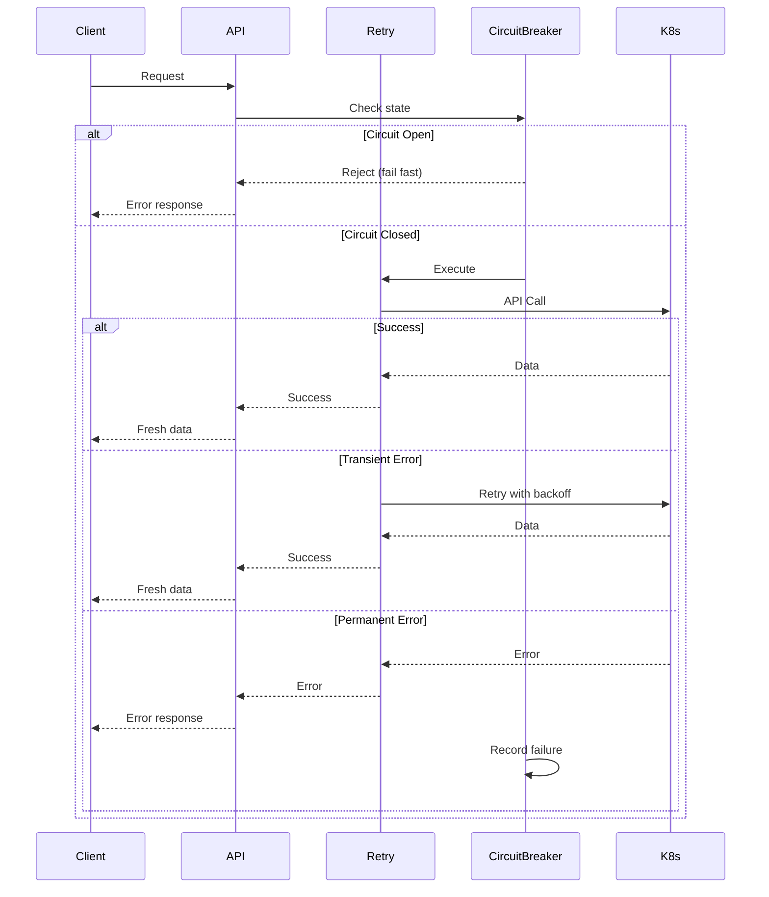

# Architecture: Interaction with Kubernetes

This document describes how kube-ingress-dash interacts with Kubernetes and the overall system architecture.

## System Architecture

The following diagram illustrates the overall architecture of kube-ingress-dash:



## Detailed Interaction Flow

The interaction between kube-ingress-dash and Kubernetes follows this flow:



## Multi-Namespace Streaming

The application supports real-time streaming of ingress resources across multiple namespaces using Server-Sent Events (SSE):



### How It Works

1. **Client Connection**: Browser establishes SSE connection to `/api/ingresses/stream`
2. **Namespace Selection**: Client can filter by specific namespaces or watch all
3. **Parallel Watchers**: Separate watchers created for each namespace
4. **Event Aggregation**: Events from all watchers merged into single stream
5. **Real-time Updates**: Changes pushed to client immediately

### Benefits

- **Isolation**: Errors in one namespace don't affect others
- **Performance**: Parallel watching improves responsiveness
- **Scalability**: Efficiently handles large clusters with many namespaces

## Error Handling Architecture

The application implements comprehensive error handling with multiple layers:



### Error Classification

The application classifies errors into two categories:

- **Transient Errors**: Network timeouts, temporary API unavailability
  - Automatically retried with exponential backoff
  - Examples: `ECONNRESET`, `ETIMEDOUT`, `503 Service Unavailable`

- **Permanent Errors**: Authentication failures, permission denied
  - Not retried, returned immediately to user
  - Examples: `401 Unauthorized`, `403 Forbidden`, `404 Not Found`

### Circuit Breaker Pattern

Protects the application and Kubernetes API from cascading failures:

- **Closed State**: Normal operation, requests pass through
- **Open State**: Too many failures, requests fail fast
- **Half-Open State**: Testing if service recovered

Configuration:
- Opens at 50% failure rate over 30-second window
- Waits 60 seconds before testing recovery
- Prevents overload during outages

### Retry Logic

Implements exponential backoff for transient errors:

- Initial delay: 1 second
- Maximum delay: 30 seconds
- Maximum attempts: 3
- Backoff multiplier: 2x

## Performance Optimizations

### Caching Layer

The application implements a caching layer to reduce load on the Kubernetes API:

- **Memory Cache**: Default, fast in-memory storage
- **Redis Cache**: Optional, for distributed deployments
- **TTL**: Configurable time-to-live (default: 5 minutes)

### Request Deduplication

Prevents duplicate concurrent requests to the same resource:

- Tracks in-flight requests
- Returns same promise for duplicate requests
- Reduces API load during high traffic

### Rate Limiting

Protects both the application and Kubernetes API:

- **Application Rate Limiting**: Limits requests per client
- **Kubernetes API Throttling**: Prevents API overload
- **Configurable Limits**: Adjust based on cluster size

### Virtual Scrolling

Efficiently renders large lists of ingresses:

- Only renders visible items
- Reduces DOM nodes and memory usage
- Smooth scrolling with thousands of ingresses

## Health Checks

The application exposes a health check endpoint at `/api/health`:

```typescript
GET /api/health

Response:
{
  "status": "healthy",
  "timestamp": "2024-01-15T10:30:00Z"
}
```

Used by Kubernetes liveness and readiness probes to ensure application health.
