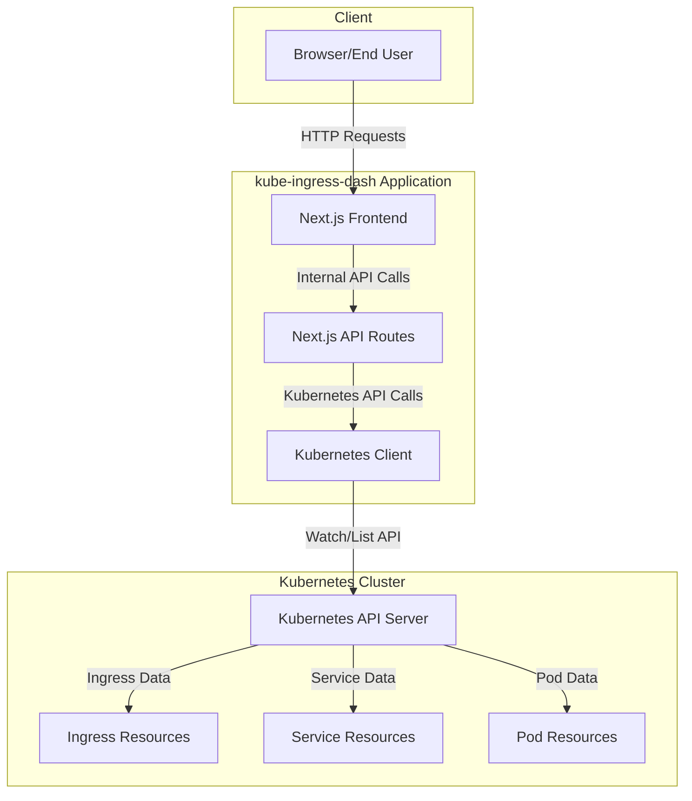
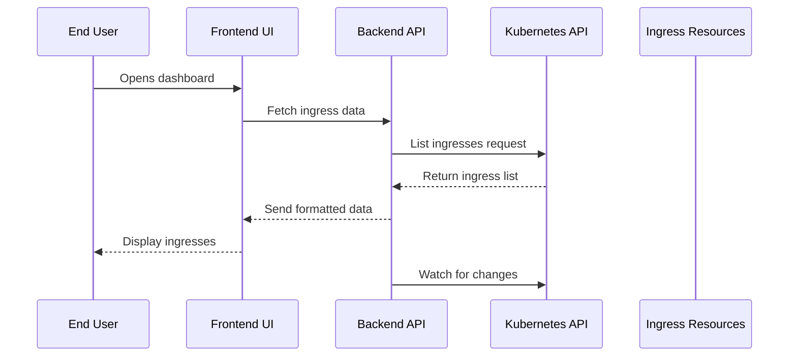

# Architecture: Interaction with Kubernetes

This document describes how kube-ingress-dash interacts with Kubernetes and the overall system architecture.

## System Architecture

The following diagram illustrates the overall architecture of kube-ingress-dash:

## Detailed Interaction Flow

The interaction between kube-ingress-dash and Kubernetes follows this flow:

