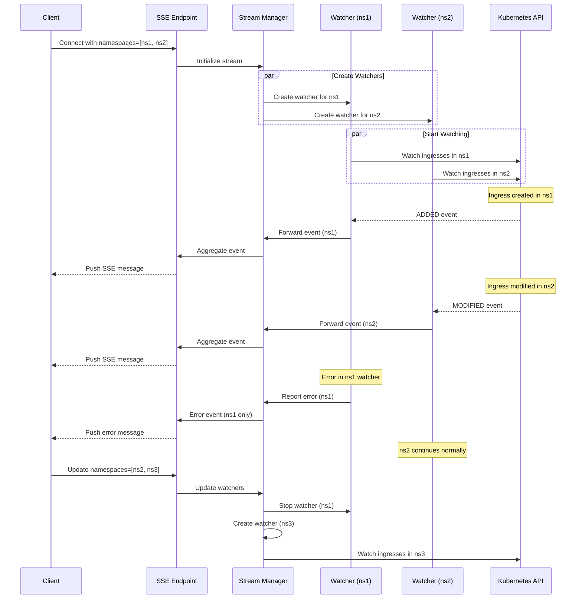

# Production Features Architecture

This document provides detailed architecture diagrams for the production-ready features implemented in kube-ingress-dash.

## Multi-Namespace SSE Streaming

### High-Level Architecture

The multi-namespace streaming system enables real-time monitoring of ingress resources across multiple namespaces simultaneously.

### Detailed Sequence Flow

### Error Isolation

```mermaid
graph LR
    subgraph "Healthy State"
        A[Watcher ns1<br/>✓ Active]
        B[Watcher ns2<br/>✓ Active]
        C[Watcher ns3<br/>✓ Active]
    end

    subgraph "Partial Failure"
        D[Watcher ns1<br/>✓ Active]
        E[Watcher ns2<br/>✗ Failed]
        F[Watcher ns3<br/>✓ Active]
    end

    G[Stream Manager]
    H[Client receives<br/>all events except ns2]

    A --> G
    B --> G
    C --> G
    G --> H

    D --> G
    E -.->|Error isolated| G
    F --> G

    style E fill:#ffebee,stroke:#c62828
    style A fill:#e8f5e9,stroke:#2e7d32
    style B fill:#e8f5e9,stroke:#2e7d32
    style C fill:#e8f5e9,stroke:#2e7d32
    style D fill:#e8f5e9,stroke:#2e7d32
    style F fill:#e8f5e9,stroke:#2e7d32
```

## Error Handling with Retry and Circuit Breaker

### Complete Error Handling Flow

### Circuit Breaker State Machine

### Error Classification Decision Tree

```mermaid
graph TB
    Error[Error Occurred] --> HasStatus{Has HTTP<br/>Status Code?}

    HasStatus -->|Yes| CheckStatus{Status Code?}
    HasStatus -->|No| CheckCode{Error Code?}

    CheckStatus -->|401, 403, 404| Permanent[Permanent Error<br/>❌ No Retry]
    CheckStatus -->|429| RateLimit[Rate Limit Error<br/>⏱️ Retry after delay]
    CheckStatus -->|500, 502, 503, 504| Transient[Transient Error<br/>🔄 Retry with backoff]
    CheckStatus -->|Other| CheckMessage{Check Error<br/>Message}

    CheckCode -->|ETIMEDOUT| Transient
    CheckCode -->|ECONNREFUSED| Transient
    CheckCode -->|ECONNRESET| Transient
    CheckCode -->|ENOTFOUND| Transient
    CheckCode -->|Other| CheckMessage

    CheckMessage -->|Contains 'timeout'| Transient
    CheckMessage -->|Contains 'refused'| Transient
    CheckMessage -->|Contains 'permission'| Permanent
    CheckMessage -->|Contains 'unauthorized'| Permanent
    CheckMessage -->|Other| Unknown[Unknown Error<br/>❌ No Retry]

    Permanent --> Return1[Return to User<br/>with Error Details]
    RateLimit --> Return2[Return to User<br/>with Retry-After]
    Transient --> Return3[Retry with<br/>Exponential Backoff]
    Unknown --> Return1

    style Permanent fill:#ffebee
    style RateLimit fill:#fff3e0
    style Transient fill:#e8f5e9
    style Unknown fill:#f5f5f5
```

### Retry Timing Diagram

## Caching and Rate Limiting Architecture

### Caching Layer Architecture

### Request Deduplication Flow

### Cache TTL and Invalidation

### Rate Limiting Architecture

### Token Bucket Algorithm

### Rate Limiting Sequence

### Kubernetes API Throttling

## Performance Optimization Architecture

### Virtual Scrolling

```mermaid
graph TB
    subgraph "Data Layer"
        A[All Ingresses<br/>1000+ items]
    end

    subgraph "Virtual Scroll Engine"
        B[Viewport Calculator]
        C[Visible Range<br/>Start: 10, End: 30]
        D[Buffer Zone<br/>±5 items]
    end

    subgraph "Rendering Layer"
        E[Rendered Items<br/>25 DOM nodes]
        F[Placeholder Space<br/>Top: 10 items]
        G[Placeholder Space<br/>Bottom: 970 items]
    end

    subgraph "User View"
        H[Visible Viewport<br/>20 items]
    end

    A --> B
    B --> C
    C --> D
    D --> E
    D --> F
    D --> G

    F --> H
    E --> H
    G --> H

    style A fill:#e3f2fd
    style E fill:#e8f5e9
    style F fill:#f5f5f5
    style G fill:#f5f5f5
    style H fill:#fff3e0
```

### Component Optimization with React.memo

```mermaid
graph TB
    subgraph "Parent Component Re-render"
        A[Dashboard State Change]
    end

    subgraph "Child Components"
        B[IngressCard 1<br/>Props unchanged]
        C[IngressCard 2<br/>Props changed]
        D[IngressCard 3<br/>Props unchanged]
    end

    subgraph "React.memo Check"
        E{Compare Props}
    end

    subgraph "Render Decision"
        F[Skip Re-render<br/>✓ Optimized]
        G[Re-render<br/>Props changed]
    end

    A --> B
    A --> C
    A --> D

    B --> E
    C --> E
    D --> E

    E -->|Unchanged| F
    E -->|Changed| G

    F -.->|Reuse| B
    F -.->|Reuse| D
    G --> C

    style F fill:#e8f5e9
    style G fill:#fff3e0
```

## Security Architecture

### Security Headers Flow

## Related Documentation

- [Multi-Namespace Streaming](../features/multi-namespace-streaming.mdx)
- [Error Handling](../features/error-handling.mdx)
- [Interaction with Kubernetes](./interaction-with-kubernetes.mdx)
- [RBAC Setup](./rbac-setup.mdx)
