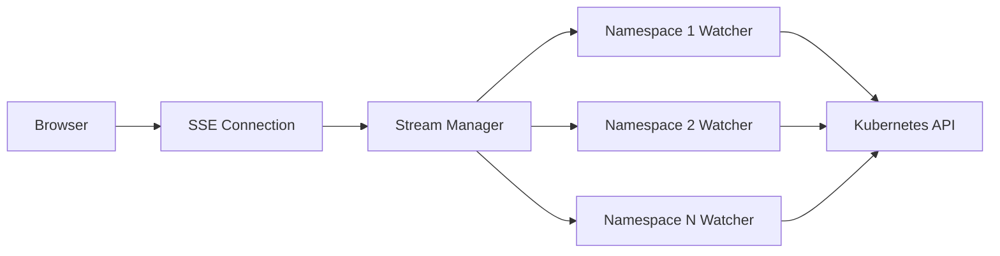

# Multi-Namespace Streaming

Real-time ingress updates across multiple namespaces using Server-Sent Events (SSE).

## Overview

The multi-namespace streaming feature allows you to monitor ingress resources across multiple namespaces simultaneously with real-time updates pushed from the server.

## How It Works

### Architecture

For detailed architecture diagrams including sequence flows, error isolation, and event aggregation, see the [Production Features Architecture](../architecture/production-features.mdx#multi-namespace-sse-streaming) documentation.



### Flow

1. **Client connects** to `/api/ingresses/stream` with optional namespace filter
2. **Server creates watchers** for each selected namespace
3. **Watchers monitor** Kubernetes API for changes
4. **Events are aggregated** from all watchers
5. **Updates pushed** to client in real-time via SSE

## Usage

### Watch All Namespaces

```typescript
const eventSource = new EventSource('/api/ingresses/stream');

eventSource.onmessage = (event) => {
  const { type, data } = JSON.parse(event.data);
  console.log(`Event: ${type}`, data);
};
```

### Watch Specific Namespaces

```typescript
const namespaces = ['default', 'production', 'staging'];
const params = new URLSearchParams({ namespaces: namespaces.join(',') });
const eventSource = new EventSource(`/api/ingresses/stream?${params}`);
```

## Event Types

### ingressAdded

Fired when a new ingress is created:

```json
{
  "type": "ingressAdded",
  "data": {
    "name": "my-ingress",
    "namespace": "default",
    "hosts": ["example.com"],
    "tls": true,
    "rules": [...]
  }
}
```

### ingressModified

Fired when an ingress is updated:

```json
{
  "type": "ingressModified",
  "data": {
    "name": "my-ingress",
    "namespace": "default",
    "hosts": ["example.com", "www.example.com"],
    "tls": true,
    "rules": [...]
  }
}
```

### ingressDeleted

Fired when an ingress is deleted:

```json
{
  "type": "ingressDeleted",
  "data": {
    "name": "my-ingress",
    "namespace": "default"
  }
}
```

### error

Fired when an error occurs:

```json
{
  "type": "error",
  "data": {
    "error": "Permission denied",
    "namespace": "production"
  }
}
```

### done

Fired when the stream closes normally:

```json
{
  "type": "done",
  "data": {
    "message": "Stream closed"
  }
}
```

## Benefits

### Isolation

Errors in one namespace don't affect others:

- Each namespace has its own watcher
- Watcher failures are isolated
- Other namespaces continue streaming

### Performance

Parallel watching improves responsiveness:

- Watchers run concurrently
- No blocking between namespaces
- Efficient resource utilization

### Scalability

Handles large clusters efficiently:

- Selective namespace watching
- Reduced memory footprint
- Lower API load

## Error Handling

### Namespace-Level Errors

If a watcher fails for one namespace:

1. Error event sent to client
2. Other namespace watchers continue
3. Failed watcher can be retried independently

### Connection Errors

If the SSE connection fails:

1. Client receives error event
2. Connection closes gracefully
3. Client can reconnect automatically

### Example Error Handling

```typescript
const eventSource = new EventSource('/api/ingresses/stream');

eventSource.onerror = (error) => {
  console.error('SSE connection error:', error);
  // Implement reconnection logic
  setTimeout(() => {
    eventSource.close();
    // Create new connection
  }, 5000);
};

eventSource.onmessage = (event) => {
  const { type, data } = JSON.parse(event.data);

  if (type === 'error') {
    console.error(`Error in namespace ${data.namespace}:`, data.error);
    // Handle namespace-specific error
  }
};
```

## Performance Considerations

### Memory Usage

Each watcher maintains a connection to the Kubernetes API:

- **Memory per watcher:** ~5-10 MB
- **Watching 10 namespaces:** ~50-100 MB
- **Recommendation:** Watch only needed namespaces

### API Load

Each watcher creates a watch request:

- **API requests:** 1 per namespace
- **Network traffic:** Minimal (only changes sent)
- **Recommendation:** Use namespace filtering

### Client Connections

SSE connections are long-lived:

- **Connection per client:** 1
- **Server resources:** Minimal per connection
- **Recommendation:** Implement connection pooling for multiple clients

## Configuration

### Server-Side

Configure streaming behavior via environment variables:

```bash
# Maximum namespaces per stream
MAX_NAMESPACES_PER_STREAM=50

# Stream timeout (milliseconds)
STREAM_TIMEOUT=3600000

# Kubernetes watch timeout (seconds)
K8S_WATCH_TIMEOUT=300
```

### Client-Side

Configure reconnection behavior:

```typescript
const config = {
  reconnectInterval: 5000, // 5 seconds
  maxReconnectAttempts: 10,
  reconnectBackoff: 2, // Exponential backoff multiplier
};
```

## Monitoring

### Metrics to Track

- **Active streams** - Number of open SSE connections
- **Watchers per stream** - Average namespaces watched
- **Events per second** - Rate of ingress changes
- **Error rate** - Percentage of failed watchers

### Health Checks

Monitor stream health:

```typescript
// Track last event time
let lastEventTime = Date.now();

eventSource.onmessage = () => {
  lastEventTime = Date.now();
};

// Check for stale connection
setInterval(() => {
  const timeSinceLastEvent = Date.now() - lastEventTime;
  if (timeSinceLastEvent > 60000) {
    // No events for 1 minute - connection may be stale
    console.warn('SSE connection may be stale');
  }
}, 30000);
```

## Best Practices

1. **Filter namespaces** - Only watch namespaces you need
2. **Handle reconnections** - Implement automatic reconnection logic
3. **Process events efficiently** - Batch updates to avoid UI thrashing
4. **Monitor connection health** - Detect and handle stale connections
5. **Clean up connections** - Close SSE connections when not needed

## Troubleshooting

### No Events Received

**Possible Causes:**

- No ingress changes occurring
- RBAC permissions missing
- Namespace filter too restrictive

**Solutions:**

1. Verify ingresses exist in watched namespaces
2. Check RBAC permissions include watch verb
3. Try watching all namespaces

### Connection Drops Frequently

**Possible Causes:**

- Network instability
- Load balancer timeout
- Server resource constraints

**Solutions:**

1. Implement reconnection logic
2. Increase load balancer timeout
3. Check server resources

### High Memory Usage

**Possible Causes:**

- Watching too many namespaces
- Large number of ingresses
- Memory leak in watcher

**Solutions:**

1. Reduce number of watched namespaces
2. Implement pagination or filtering
3. Monitor for memory leaks

## Example Implementation

Complete example with error handling and reconnection:

```typescript
class IngressStreamManager {
  private eventSource: EventSource | null = null;
  private reconnectAttempts = 0;
  private maxReconnectAttempts = 10;

  connect(namespaces: string[]) {
    const params = new URLSearchParams({
      namespaces: namespaces.join(','),
    });

    this.eventSource = new EventSource(`/api/ingresses/stream?${params}`);

    this.eventSource.onmessage = (event) => {
      const { type, data } = JSON.parse(event.data);
      this.handleEvent(type, data);
      this.reconnectAttempts = 0; // Reset on successful message
    };

    this.eventSource.onerror = () => {
      this.handleError();
    };
  }

  private handleEvent(type: string, data: any) {
    switch (type) {
      case 'ingressAdded':
        console.log('Ingress added:', data);
        break;
      case 'ingressModified':
        console.log('Ingress modified:', data);
        break;
      case 'ingressDeleted':
        console.log('Ingress deleted:', data);
        break;
      case 'error':
        console.error('Stream error:', data);
        break;
    }
  }

  private handleError() {
    this.disconnect();

    if (this.reconnectAttempts < this.maxReconnectAttempts) {
      const delay = Math.min(1000 * Math.pow(2, this.reconnectAttempts), 30000);
      console.log(`Reconnecting in ${delay}ms...`);

      setTimeout(() => {
        this.reconnectAttempts++;
        this.connect([]);
      }, delay);
    }
  }

  disconnect() {
    if (this.eventSource) {
      this.eventSource.close();
      this.eventSource = null;
    }
  }
}
```

## Related Documentation

- [Architecture Overview](../architecture/interaction-with-kubernetes.mdx)
- [Error Handling](./error-handling.mdx)
- [RBAC Setup](../architecture/rbac-setup.mdx)
